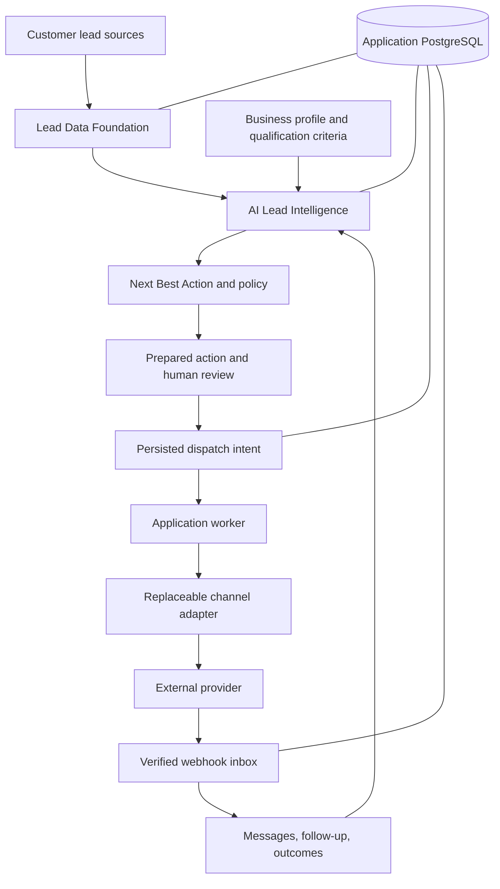

# Architecture

Product: **AI Lead Intelligence & Outbound Automation**
Review date: 2026-09-12
L0 documentation planning and the bounded local L1 safety slices have evidence. L2-01 implements versioned business/enquiry context, L2-02 reviewed imports, L2-03 reviewed identity L2-04 contact correction/archive/export, L2-05 freshness, L3-01 configured fit L3-02 interpretation quality and L3-03 durable analysis/usage and L3-04 audited feedback/protected evaluation; [TASKS.md](TASKS.md) owns live status. L4-01A now adds reviewed first-channel setup and strict live capability holds; provider acceptance remains open. Proposed architecture changes retain their implementation contract review gates.

## Reading this document

This document separates the inspected implementation from the proposed launch architecture. A target invariant below is a requirement to implement and test, not a claim that current code enforces it. [DECISIONS.md](DECISIONS.md) records design choices, conflicts with earlier decisions, alternatives, and implementation gates. [TASKS.md](TASKS.md) owns completion status; [TESTING.md](TESTING.md) owns verification requirements.

Earlier M0-M10 and Phase 1-5 notes described successive implementation slices. They are historical evidence, not simultaneous descriptions of the current product. See [milestone history](history/MILESTONES.md) and [historical roadmap](history/ROADMAP_M0_M10.md).

## Batch A implementation boundary

See [batch evidence](verification/BATCH_A.md) for the earlier implementation boundary. The subsequent L1-03, L1-04/L1-08, L1-05, L1-07, L1-06 and L1-10 sections record adoption beyond that batch; their local evidence does not close PostgreSQL, provider or human acceptance.

- Normal tests use a sanitized SQLite child; PostgreSQL tests require an explicit disposable target and run-owned schema namespace. E2E uses fresh memory storage and a capability handshake before workflow verification writes.
- Test-control routes require explicit local opt-in. Staging/production cannot expose synthetic callbacks/inbound, worker, due-run or failure-injection controls. The HTTP worker operates only on the session workspace; internal server worker execution remains cross-workspace by design.
- Batch A scoped callback actions and rejected conflicting global event IDs. L1-05 added exact execution/fence correlation and atomic core effects; L1-07 below now adds a scoped inbox and replay cursors, preserving old global keys as historical records.
- Current HTTP writes, settings and approval access require OWNER. Sessions must agree with the user's workspace. Approval names and audit actor IDs come from the session; immutable approved envelopes are now implemented in the local L1-08 slice below.
- At Batch A, sequence enrollment validated selected lead ownership but did not commit atomically. L1-06 now commits selection validation, enrollment and audit under one workspace transaction; the earlier batch evidence remains historical.
- React consumes the authenticated test-control capability and hides unavailable simulation UI. Production does not automatically fabricate mock delivery or human-task completion; real operator completion remains L4.

## Bounded intelligence implemented in Batch A

Default and configured paths share tenant/lead/snapshot and exact field/value-reference checks. Model synthesis selects supported records; the application quotes them. Recommendation/planning remain deterministic, with configured paths labeled DETERMINISTIC_SAFETY. Planner inputs now include trusted lead/snapshot context. Explicit opt-out interpretation precedes model classification; uncertainty and rejected output escalate.

Generation metadata persists in existing JSON columns. Three pipeline versions invalidate reuse of older derived outputs, but do not revoke old queued actions. Neutral drafts omit unsupported relationship/operating promises and arbitrary workspace sign-offs. A shared rendered-message helper aligns provider copy with the stored conversation; dispatch now uses a captured approved envelope; factual correctness of human-edited copy remains the reviewer's responsibility. See [AI evidence and limits](verification/L1-09.md).

## Direction retained

- Build a Node.js modular monolith with explicit domain, repository, and adapter boundaries.
- Lead Intelligence is the core domain. Outbound Automation executes its recommendations through application policy.
- The database owns tenant data, intelligence, approvals, actions, messages, workflows, and audit history.
- External AI and channel providers remain replaceable. n8n is an optional execution adapter, not a required path or source of business state.
- Lead Discovery remains an optional future input adapter.
- React explains persisted business state and submits commands; it does not decide authorization, eligibility, or execution state.

The diagram is the target product flow. Durable dispatch/recovery and the supported SendGrid/internal inbox now have local L1 implementation evidence. Business context, full conversation/outcome work and external acceptance still require launch work.

## Inspected implementation baseline

| Area | Exists in the repository | Material limitation |
|---|---|---|
| Runtime | `src/server.js`, `node:http`, async services/repositories, React under `client/`; static assets come from `client/dist` | Large API composition file; extract routes as affected features change without a framework rewrite |
| Persistence | Scoped SQLite/pg transactions, approval unit of work, serialized forward migrations and read-only runtime/readiness | PostgreSQL concurrency/restricted-role and restored-upgrade acceptance pending; other multi-record domains still need adoption |
| Data | Positional CSV mapping/review, corrections, typed enquiry sources, frozen selection and atomic resumable row outcomes | Duplicate/contact/enquiry resolution, broader data work, actual PostgreSQL and operator acceptance remain unfinished |
| Intelligence | Persisted evidence/snapshots; default/configured exact-source validation; bounded model selection and deterministic recommendation/planning | Source attribution does not prove source truth or business fit; richer qualification and evaluated usefulness remain L2/L3 |
| Execution | Immutable review, due-time/bounded retry, fenced attempts, exact callbacks, owner recovery, global/workspace pause and durable attempt/uncertainty limits | Monetary limits, actual PostgreSQL/provider proof and human recovery acceptance remain open |
| Webhook inbox | Durable verified input, fenced bounded replay, callback/inbound effects cursors, owner review and payload cleanup | Legacy ambiguity requires quarantine; live provider and PostgreSQL/browser acceptance remain pending |
| Channel setup | Revisioned owner email settings, explicit unique routing aliases, structural readiness and exact reviewed Reply-To | Complete SendGrid setup remains unverified and cannot authorize new live dispatch; other live choices are unsupported |
| Scheduling | Normal worker uses persisted workspace/phase scheduling, DB-only workflow advancement, due follow-up updates and bounded event recovery | Actual PostgreSQL fairness/load, browser workflow acceptance, business timezone/quiet-hours and full human-task journey remain open |
| Replies | Staged canonical inbound processing, classification, conversation/follow-up effects and worker intelligence refresh | Human reply/assignment/resolution and live provider acceptance remain incomplete |
| Operations | Strict connection/configuration policy, verified TLS transport, bounded HTTP/auth/provider input, durable auth admission, safe logs and owner sending controls | Actual deployed TLS/roles/restore, measured load/cost, customer access recovery and live operator/channel proof remain gates |

Source anchors: [database contract](../src/database/database.js), [action executor](../src/modules/handlers/actionExecutor.js), [action query](../src/modules/outbound-automation/actionsRepository.js), [callbacks](../src/modules/outbound-automation/callbacksService.js), [LLM synthesis](../src/modules/ai/llmSynthesisAgent.js), [server loop](../src/server.js). Module existence is not production-readiness evidence.

## Public landing architecture: proposed L4/L5 work

[LANDING_PAGE](LANDING_PAGE.md) specifies a public static/indexable entry with a lazily enhanced synthetic example, separate authentication pages and a protected /app area. Current React routing still gates every page with the session; these route changes are not implemented. Keep the current Node API/React toolchain and session ownership, preserve old work-route links through tested redirects, and keep dashboard code and tenant data out of the public bundle. The demo must make no domain/provider mutations. A real commercial CTA needs an implemented and tested receiving path before release.

## Module responsibility and dependencies

| Domain | Owns | Consumes | Must not own |
|---|---|---|---|
| Identity/workspace | Users, sessions, membership/roles, tenant ownership | Credential verification and settings adapters | Client-supplied tenant authority |
| Business configuration | Versioned offering, target criteria, region/timezone, communication preferences | Owner-approved setup | Provider-specific business rules |
| Data Foundation | Imports, attributes, normalization, identity candidates, provenance, corrections | Source adapters | AI facts silently replacing customer data |
| Lead Intelligence | Evidence, claims, signals, assessments, snapshots, explanations, evaluation metadata | Business context and interaction facts | Sending or approval bypass |
| Next Best Action / policy | Proposed action, reasons, eligibility, approval requirements | Intelligence and current contact/workflow state | Provider calls |
| Outbound Automation | Prepared revisions, approvals, actions, dispatch attempts, retry/reconciliation | Policy and adapter interfaces | Intelligence as mutable execution metadata |
| Conversations/workflows | Timeline, human tasks, replies, sequence progression, stop conditions | Verified normalized events | Provider execution history as authoritative state |
| Channel setup | Reviewed email configuration, route ownership, structural prerequisites and finite capability holds | Owner commands, current settings and workspace transactions | Provider verification inferred from credentials, contact consent or enquiry assignment |
| Adapters | Provider authentication, transport, normalized results/events | Explicit application commands | Arbitrary domain updates |
| Webhook inbox | Verified immutable receipts, processing claims, retry/quarantine/review and retention | Fixed normalized provider/internal handlers | Outbound resends or authority from payload IDs |
| Events/audit | Durable events, fenced stage/retry/review state and concise transition history | Validated domain changes and typed handlers | Payload-selected handlers, hidden chain-of-thought or secrets |
| Scheduler | Persisted workspace visits and rotating bounded phases | Eligible typed domain queues | Replacing job ownership, provider outcome facts or tenant policy |

L2-01 business configuration and enquiry snapshots live in the business-context module inside the existing modular monolith. Separate services or a generic plugin framework are unnecessary.

## PostgreSQL on Supabase

Use managed Supabase PostgreSQL as the planned staging/production host through the existing standard `pg` boundary. This is a hosting choice; no MongoDB migration, direct browser database access, or replacement of current authentication with Supabase Auth is planned. The Node API continues to own business logic.

Core relationships use relational columns, foreign keys, unique constraints, and transactions. Validated flexible business attributes and provider metadata may use JSONB through additive migrations. Keep indexed identity/status/schedule/ownership fields outside opaque JSON. Do not rewrite every serialized column to JSONB merely for consistency.

1. Separate development/test, staging, and production databases and credentials. Tests never use customer production data.
2. Select a region near the app and appropriate to initial customers. Persistent Node can use direct connections where IPv6 is available, or session pooling for IPv4-only connectivity. Validate the actual hosting mode; transaction pooling is not a blanket default.
3. Budget connections across API instances, workers, deployment overlap, tests, and operations. Every process has a bounded pool.
4. L1-10 uses certificate/hostname verification, TLS 1.2 minimum and default trust or a bounded explicit DATABASE_SSL_CA bundle. Deployed plaintext and hostile URL/ambient PG overrides are refused before connection. Actual hosted certificate/role/rotation proof remains required.
5. Separate runtime and migration privileges. Keep application tables inaccessible to public Data API roles and inventory exposed schemas. API-only access does not follow automatically from using `pg`. RLS, if introduced, needs explicit role/session design; privileged connections can bypass it.
6. Verify backup retention, recovery capabilities, export portability, and restore rehearsal before onboarding. Do not infer recovery from a hosting plan name.
7. Preserve monetary precision. Current global BIGINT/NUMERIC-to-Number parsing was built for counters. Outcomes and costs need exact minor units plus currency or a deliberate decimal contract, with precision tests.

See [ADR-001](DECISIONS.md#adr-001-postgresql-on-supabase) and [deployment runbook](DEPLOYMENT.md). Another PostgreSQL host remains a viable replacement.

## Persistence boundary and migration safety

The current async client is `exec`, `run`, `get`, `all`, `columnExists`, `transaction`, and `close`. Repositories write a shared SQLite-compatible SQL subset; the PostgreSQL adapter translates placeholders. These are implementation facts.

**L1-03 implementation:** application transactions and narrow engine-specific locking now follow the [persistence contract](L1-03_PERSISTENCE.md). This replaces the earlier migrations-only transaction restriction. Approval review, settings writes, contact restrictions, dispatch authorization, lease expiry, owner resolution, receipt claims and staged callback/inbound effects now use the workspace policy transaction under the accepted L1-05/L1-07 contracts. Real PostgreSQL acceptance remains pending. See [ADR-002](DECISIONS.md#adr-002-operational-transactions-and-database-specific-claims) and [verification](verification/L1-03.md).

- createUnitOfWork(db, buildContext).run(work) builds fresh repositories with a distinct transactionBound client. Parent-client calls in the callback context, nested transactions and expired scoped handles reject. SQLite queues shared-connection operations; PostgreSQL pins one checked-out connection. Business callbacks never replay automatically.
- Approval request/current/preview/approve/reject/revoke first lock the workspace and then the tenant-owned action. Immutable revision, decision, current projection, status and audit commit together. Decisions require the displayed expected_revision_id; review cannot reactivate blocked/completed/in-flight actions. New action creation and its review request remain separate pending later durable-intent adoption.
- Keep network/LLM/provider calls outside database transactions. Persist intent, release locks, invoke, then conditionally persist outcome.
- PostgreSQL may use conditional updates or row locking with `SKIP LOCKED` for competing consumers. SQLite uses a suitable local implementation of the same behavioral contract; it does not prove PostgreSQL isolation.
- Protect invariants with database constraints and compare-and-set revisions. Application pre-checks alone do not protect concurrent requests.
- Append migrations after `0001_baseline_schema`; never silently edit or replay an applied migration. Inventory databases that recorded older baseline content and add forward repairs where needed.
- runMigrations locks before ledger/history access and atomically applies each migration with its marker. History must be a known contiguous registry prefix. The immutable baseline is followed by 0002_runtime_column_reconciliation, 0003_contact_restrictions, 0004_prepared_action_revisions, 0005_bounded_dispatch_recovery, 0006_durable_webhook_receipts, 0007_scheduler_event_recovery, 0008_operational_controls, 0009_business_context, 0010_reviewed_import, 0011_import_identity_resolution, 0012_lead_data_management, 0013_intelligence_freshness, 0014_business_fit, 0015_analysis_jobs_ai_usage and 0016_intelligence_feedback_evaluation. The later L2/L3 sections define their additive records; earlier migrations remain unchanged. 0011 adds scoped immutable import identity decisions without backfilling links. 0010 adds reviewed import metadata, raw cells, correction history and scoped outcomes, plus an indexed application-normalized name/company hash whose bounded backfill preserves original fields. 0009 adds versioned business/enquiry snapshots and scoped actor/lead foreign keys, without backfilling customer facts. 0008 adds durable auth admission and typed workspace dispatch controls without changing previous records or migrations. 0007 adds managed event/stage/review and workspace scheduling state, workflow revisions/anchors and typed action links; unfinished legacy events/runs remain held instead of inferred or replayed. 0006 preserves legacy callback/inbound history with unlinked LEGACY_UNKNOWN cursors while adding receipt/review records. 0005 adds retry/ownership/outcome records and append-only dispatch_resolutions; ambiguous legacy attempts remain LEGACY_UNKNOWN with execution holds, and invalid/duplicate historical attempt numbers refuse migration for review.
- Normal startup uses openRuntimeDatabase, requiring an existing current schema without DDL. Status/readiness/verify:deploy inspect only. db:migrate is explicit; deployed runs require dedicated migration credentials outside the web process. The disposable E2E memory bootstrap is the sole server exception.
- Local empty/upgrade/interruption/concurrency regressions exist; real PostgreSQL and compatible app rollout/restore evidence remain required.
- Prefer expand/backfill/validate/contract changes for populated production tables. Record recovery steps before destructive schema changes.

## L1-04/L1-08 implemented dispatch boundary

The [shared contract](L1-04_L1-08_DISPATCH.md) was recorded before implementation. Append-only contact_restrictions is authoritative independently of lead lifecycle; direct canonical duplicates inherit effective restrictions without graph merging. ALL scope matches any directly shared identity across channels; EMAIL-only provider restrictions remain EMAIL-only.

Review creates immutable action_revisions and action_revision_decisions. The existing approval row is a current projection. UI commands carry the revision actually displayed; edits create a new preview before approval. Recipient, sender account, content, schedule and private context/config fingerprints are checked again at dispatch. A settings change, including credential rotation, requires renewed review.

All supported SEND actions use a short workspace transaction to reload authority, check restrictions/revision, and persist STARTED attempt plus EXECUTING ownership. Provider I/O follows after commit using the captured envelope/configuration; adapters do not reread settings or lead contact. Unsupported handlers fail closed. Unknown outcomes remain held; local concurrent callers cannot create another in-flight dispatch.

SendGrid verification binds timestamp and original request bytes to configured public keys. Contact-policy effects precede optional classification/ancillary processing. Failed receipt storage returns retryable HTTP errors. Once received durably, required policy can remain pending and block dispatch while bounded processing retries. L1-05 exact attempt/core transactions and the L1-07 inbox/effects cursor preserve that boundary across crashes.

See the earlier [integrated evidence](verification/L1-04-L1-08.md). The next section records implemented due-time, retry and recovery behavior; PostgreSQL multi-process, live provider and human/browser gates remain open.

## L1-05 implemented bounded execution and recovery

The [accepted contract](L1-05_EXECUTION_RECOVERY.md) and [local verification](verification/L1-05.md) define the current slice. Migration 0005 preserves the coarse action/attempt statuses while adding explicit outcome_class, active execution/fence, lease, frozen revision/hash/provider key, retry policy timestamps and append-only owner resolutions.

Dispatch authorization commits a STARTED/DISPATCHING attempt and EXECUTING action before provider I/O. The current defaults are three total attempts per action and a one-hour elapsed retry window, frozen at first authorization across edits/reviews/restarts. scheduled_at and next_attempt_at are enforced; invalid or future times cannot dispatch. Known nonacceptance can use persisted exponential backoff from a 30-second base, capped at five minutes, with half-to-full jitter and the longer valid Retry-After hint. A hint beyond the deadline exhausts work rather than shortening the provider wait.

Each authorization has a 60-second lease and increasing fence; provider requests have a 15-second bound. Outcome persistence requires the same active execution, owner/fence and live DISPATCHING lease. Expiry, timeout, transport loss and ambiguous 5xx become UNCERTAIN and cannot be blindly resent. There is no separately reclaimable pre-send state: authorization itself is treated as potentially dispatched. A stable provider intent key binds action/revision; Resend keeps identical payload bytes and a conservative persisted 23-hour first-use expiry, without extending it on retry. Other providers do not acquire idempotency guarantees from that application key.

Owner recovery commands inspect the exact current attempt/fence and record either evidenced ACCEPTED or CLOSE_WITHOUT_RETRY. Acceptance is not delivery; neither decision permits resend, resets budgets or fabricates review. Historical unbound attempts remain held for inspected remediation. Shutdown stops new dispatch and waits for HTTP, worker and executor activity before database close, with a 30-second drain deadline; timeout leaves durable ownership for expiry/reconciliation.

Live SendGrid terminal callbacks require exact execution/revision metadata and recorded provider/tenant ownership. Callback receipt, exact attempt outcome, conditional active action transition, audit and completion event commit together. Stale/closed/conflicting terminal events retain evidence without regressing newer state. Exact message effects recheck ownership; a missing conversation entry can be recovered from the attempt's immutable revision/hash without rerendering current lead/settings. L1-07 now adds the durable ancillary repair cursor described below. SendGrid event IDs have a 2,048-character application bound, with long policy identities hashed and existing short identities preserved.

These are local implementation results, not launch certification. Real PostgreSQL concurrency/restore, provider retry/signature behavior and human/browser recovery gates remain pending.

## Reliable action execution: remaining target

The broader target integrates the implemented boundary above and L1-10 pause/attempt controls below with unfinished shared composition, verified channel health and monetary/AI cost limits:

1. Resolve workspace, actor permissions, contact identity, supported channel, sender connection, and immutable content/recipient revision. A new user intent creates a new action; retries of that intent return the same action.
2. Evaluate policy and persist approval for the exact revision when required. Concurrent edit/approve/reject commands use expected revisions and atomic transitions.
3. In one short transaction, claim an eligible due action and persist attempt and dispatch intent with lease owner, expiry, fencing token, retry eligibility, and payload fingerprint. An action/attempt table can serve as the first durable outbox; no broker is required.
4. Recheck current suppression, approval/content/recipient version, workspace pause, workflow stop, channel health, schedule, and rate budget at dispatch authorization. Use a common serialization point for suppression changes and dispatch authorization. Mark `DISPATCHING` before HTTP without holding a database transaction across it.
5. Invoke the adapter with the immutable envelope and stable provider idempotency key for retries of the same intent. Do not silently switch providers during an uncertain send.
6. Persist outcome only with the current claim token. A stale worker cannot overwrite a newer owner. Provider acceptance and delivery are separate; uncertainty remains durably visible.
7. Reconcile callbacks, timeouts, and interrupted work. Retry only after classifying a known safe retry; otherwise expose uncertainty and reconcile or require operator resolution.

**Guarantee boundary:** the app prevents duplicate concurrent dispatch authorization and preserves durable intent. It cannot promise exactly-once external delivery across arbitrary providers. A process may lose its lease or crash after provider acceptance. Expired leases with possible dispatch move to reconciliation, not blind resend. Provider keys help within the provider's supported retention and behavior.

Suppression effective before dispatch authorization blocks sending. Suppression arriving after dispatch begins stops later work and records that a request may already be in flight. Submitted external messages cannot always be recalled.

Retries need persisted `next_attempt_at`, bounded attempts and elapsed time, jittered backoff, provider rate-limit handling, and terminal reasons. HTTP timeout is ambiguous, not automatically safe to retry. Recipient rejection, opt-out, or cancellation cannot create an indefinite retry loop.

## Scheduling, replies, and state ownership

- L1-06 stores validated offset-derived UTC instants and preserves anchors across late ticks/restarts. Versioned business timezone, quiet hours and general rescheduling remain target work; the current page displays its browser timezone and exact saved UTC instant.
- The normal worker now coordinates persisted fair workspace visits across receipt, event, workflow, follow-up, dispatch and expiry phases. Each domain keeps its own ownership rules. Add processes only after the required actual PostgreSQL concurrency proof.
- Reply/opt-out handling cancels or blocks existing pending actions as well as future steps. Stopping only the workflow leaves already-created sends eligible.
- Delivery events update delivery state. They never clear suppression, assert interest, or resolve human tasks.
- Separate provider acceptance, delivery, recipient response, business outcome, and contact permission. See [DOMAIN.md](DOMAIN.md).
- Human replies use the same prepared-message and policy path. Assignment, due follow-up, resolution, and reopening are persisted commands with actor attribution.

## L1-07 implemented webhook inbox and recovery

The [accepted replay contract](L1-07_WEBHOOK_REPLAY.md) and [integration evidence](verification/L1-07.md) define the current local implementation. Migration 0006_durable_webhook_receipts adds a database inbox, append-only owner reviews and linked callback/inbound effects cursors. No broker or external workflow system owns this state.

Verify provider authentication over the required original bytes, enforce request limits and resolve the tenant before persisting normalized input. Receipt identity is the tuple of workspace, provider, connection, event family and provider event ID, with a unique hash and immutable payload hash. Current families are EXECUTION_CALLBACK, SENDGRID_EVENT and INBOUND_MESSAGE. The stored input is bounded to 256 KiB and excludes raw MIME, authentication headers and unknown provider objects. Supported provider acknowledgement means durable receipt, including pending/quarantined processing; failure to store receipt returns 503 for redelivery. Receipt does not mean delivery or completed lead work.

Receipt processing states are RECEIVED, PROCESSING, RETRY_PENDING, PROCESSED, QUARANTINED and DISMISSED. The default budget is five total processing attempts and 24 hours from the first claim, with a 60-second lease and exponential delay from five seconds capped at 300 seconds with half-to-full jitter. Each handler asserts receipt owner/fence and live lease under its workspace transactions. Both success and failure persistence are fenced. Expired processing can be reclaimed because replay performs idempotent local effects and never sends another outbound message.

Receipt INSERT, restriction writes and dispatch authorization share the workspace gate. Any mandatory_policy_status=PENDING receipt defers new dispatch without creating an attempt, resetting approval or permanently blocking the action. Durable contact restrictions still take priority. Callback/inbound follow-up effects retain a retryable PENDING cursor when policy is unresolved. This intentionally conservative workspace hold avoids granting permission while an acknowledged opt-out is still waiting to apply.

Changed-content conflicts retain the first input and create separate conflict evidence. A claimed bounded handler processes only mandatory policy for that conflict: applicable restrictions may commit, but lead creation, delivery transitions, messages, tasks and domain-event projections cannot run. Policy becomes DONE only after those effects commit or the handler positively determines none applies. Same-workspace conflicting action references cannot discard a valid recipient restriction; every supplied known reference is checked first, and known foreign references fail before effects.

Callback core projection, exact execution/action transition, audit/event and PENDING cursor commit atomically. Message recovery, follow-up creation or explicit skip and the effects marker then commit together. Replay reads the immutable revision/hash bound to the exact attempt, checks active execution/fence, current and original recipient restrictions, canonical replies and linked stopped workflows. Due time remains original execution completion plus 48 hours. Stale/closed callbacks preserve evidence; absent immutable human-task copy and unlinked legacy callbacks require quarantine instead of reconstruction from mutable state.

InboundMessageService stages canonical identity/classification, any new lead plus provenance/event, and required policy/stop effects before the remaining conversation/lead/task/event transaction. Classification occurs outside database locks, explicit local opt-out wins, and replay reuses the stored classification. All canonical reply types remove obsolete no-response work; question/unknown may retain a separate human review task. LeadReplyReceived worker processing refreshes the deterministic snapshot first, including opted-out/suppressed signals, then skips optional recommendation/planning for restricted leads. Eligible leads continue through synthesis, recommendation and planning. The webhook does not run those intelligence pipelines.

A quarantined receipt with unresolved policy still holds the whole workspace. Invalid/foreign identity cannot be corrected or waived by ordinary RETRY/CLOSE; it requires inspected operator remediation. Complete recovery for these cases is an explicit pre-customer operational gate, not an implemented self-service guarantee.

Owner inspection is paginated. RETRY and CLOSE require the exact receipt fence, session actor and evidence; RETRY uses unchanged input and remaining original budget, while CLOSE requires policy DONE and no live handler. Neither permits sending, edits correlation or resets limits. Completed/dismissed receipts cannot reopen. After 30 days from processing completion or closure, bounded cleanup may purge normalized bodies of PROCESSED/DISMISSED rows while retaining deduplication identity/hash/state/review tombstones; unresolved payloads remain.

Existing callback/inbound history remains unlinked with LEGACY_UNKNOWN markers. No migration infers completed effects or creates retrospective inbox receipts. The subsequent L1-06 slice below adds managed domain-event retry and normal due scheduling; thread assignment, human composing/resolution and a verified customer outcome loop remain L4. Real PostgreSQL multi-process/least-privilege/restore, live signed provider redelivery and browser/keyboard/mobile QA remain required; this local implementation does not certify launch.

## L1-06 implemented scheduling and lead-processing recovery

The [recorded scheduling contract](L1-06_SCHEDULING.md), [integrated evidence](verification/L1-06.md) and [workflow evidence](verification/L1-06-workflows.md) define this local slice. It extends ADR-002/005/006/007 through ADR-012 without adding a broker, microservice or provider dependency. Migration 0007_scheduler_event_recovery preserves 0001-0006 and historical facts while adding managed event processing, stage/review records, scheduler cursors, workflow revisions/anchors and typed workflow action links.

DomainEventProcessor claims one managed event under the workspace gate with owner/fence/live lease. It uses five total attempts, a 24-hour original deadline, a 120-second lease, and five-second exponential retry capped at 300 seconds with half-to-full jitter. Unknown handlers and invalid/legacy input quarantine visibly; notification-only event types use an explicit no-op handler. Legacy unfinished events retain status/body/history with LEGACY_EVENT_REVIEW_REQUIRED and cannot be promoted by RETRY. Owner inspection/review exposes safe status/stage/history rather than raw payload or exception text; RETRY/CLOSE require the current fence, session actor and evidence without resetting budgets.

LeadCreated atomically normalizes only a NEW lead, refreshes deterministic intelligence and materializes at most one initial action with its audit/stage cursors. LeadReplyReceived first refreshes its snapshot, then processes synthesis, recommendation and plan as separate guarded stages. Typed input is prepared under the gate, generation occurs outside every database transaction, and the commit rechecks the same event fence/lease and exact current input fingerprint. Existing application validation/finalization consumes a fixed generated output at commit; no network-capable agent runs inside the transaction. Completed artifacts are reused for unchanged evidence, while changed evidence invalidates the stage cursor and stale generated output cannot commit. A crash after generation can repeat a bounded model call; exactly-once model cost is not claimed.

Contact planning checks durable restrictions across canonical duplicate contacts independently of coarse lifecycle state. Restricted leads receive truthful snapshots and skip contact recommendation/planning; unresolved mandatory receipt policy defers planning for a bounded retry. Policy is checked again after generation. Reply plans do not automatically create outbound actions.

WorkflowsService commits one reloaded transition or materialization per due run and never invokes a provider. WAIT uses the persisted eligibility anchor; approved, accepted, retrying or uncertain SEND work cannot advance until the exact current execution is DELIVERED and its action is COMPLETED. Post-completion delay uses that persisted instant. Human-task acceptance is not real completion. New SEND actions always require an exact review, with unique typed run/step links and explicit same-workspace/lead/sequence validation. Unchanged approval/acceptance waits and valid paused actions do not occupy the bounded candidate queue; malformed links/times produce visible blocked outcomes.

The owner Workflows page uses ordinary campaign/sequence/enrollment and revision-checked PAUSE/RESUME/STOP APIs. Explicit scheduling inputs require an offset and become canonical UTC. Pause preserves timing and existing review; resume cannot reopen terminal history or clear legacy holds. STOP cancels eligible queued linked actions, preserving in-flight facts. Dispatch repeats current run/step/parent/lead/workspace checks immediately before claim. Every canonical reply, including questions and unknown interpretations, stops existing sequences and queued actions while retaining separate human response tasks. New stop_on_reply=false is rejected; historical false flags stay conservative. A provider call already authorized before a stop can finish.

SchedulerService reserves at most four workspace visits per tick under a persisted round-robin cursor, with a ten-second soft admission budget and a 120-second visit lease. It reserves one visit at a time, persists each phase successor before work and checks live visit ownership before admitting the next phase. Per-visit caps are RECEIPTS 2, EVENTS 1, WORKFLOWS 2, FOLLOW_UPS 5, DISPATCH 2, EXPIRY 2. Shared eligible-query predicates prevent a noisy tenant or unchanged paused/approval work from occupying earlier global limits. These are bounded admission rules, not a proven p95 or hard completion deadline. Underlying event/receipt/action/workspace guards remain authoritative.

Due follow-up processing changes only eligible PLANNED tasks to DUE with one audit; malformed historical due instants become BLOCKED for review. No external reminder is sent and no task is marked complete by a timer. Owner follow-up complete/cancel commands use explicit transactional state checks and audit; invalid/terminal history cannot be rewritten, and completing a follow-up does not imply linked workflow human-task completion. Worker shutdown stops new visits/event claims and drains admitted operations alongside existing dispatch/inbox/HTTP work. Browser/human schedule and recovery QA, actual PostgreSQL multi-process/restore/least-privilege proof, live provider behavior and customer outcomes remain open. Full timezone/quiet-hours, composer/thread/assignment/human completion and notification journeys retain their L2/L4/L5 gates.

## L2-01 implemented business context boundary

The [recorded context contract](L2-01_BUSINESS_CONTEXT.md), [integrated evidence](verification/L2-01.md) and [backend checks](verification/L2-01-backend.md) implement the small versioned-context portion of ADR-008. Lead Intelligence remains the core domain; context capture neither grants contact permission nor replaces the customer's existing systems.

BusinessContextService owns validated profile and enquiry updates through the existing workspace policy transaction. It rechecks the current database owner, lead/workspace ownership and expected revision, then appends the complete normalized snapshot with its audit in one commit. Identical normalized content at the current revision is a no-op; stale requests conflict. Repository append requires the same workspace gate. No provider call, model generation, workspace-wide lead rewrite or automatic analysis event runs inside this command.

Immutable migration 0009_business_context adds business_profile_revisions keyed by workspace/revision and lead_enquiry_revisions keyed by workspace/lead/revision. The highest revision is current; prior records remain source history. Composite foreign keys enforce actor and lead workspace ownership. JSON TEXT stores bounded validated snapshots; indexed ownership/revision columns remain relational. This deliberately avoids the existing PostgreSQL numeric-to-Number compatibility parser: budget amounts use exact decimal input and canonical integer minor-unit strings with explicit currency scale. Decimal conversions use string operations/BigInt and never exchange rates or floating-point arithmetic. The driver-wide numeric policy is unchanged.

Profiles capture offerings, service areas, target/exclusion descriptions, required/preferred human criteria and optional next-step/timezone/language preferences. Criteria are stored customer context, not an executable rules engine or a scored-fit claim. One active enquiry snapshot per lead contains six typed facts, each explicitly UNKNOWN, KNOWN or CONFLICTED. Source assertion and observation time remain separate from server capture/actor metadata. Source references are unverified operator-entered text, not fetched evidence or permission. This slice does not map raw import columns, merge duplicate contacts or turn another enquiry into a correction silently.

Read-only loadLeadBusinessContext supports transaction clients and supplies current profile/enquiry wrappers plus revision tokens. These revisions enter snapshot fingerprints and cascade into current synthesis/recommendation/plan checks; old artifacts retain their history. Zero/zero context preserves old fingerprints. Context saves expose the need to run analysis again instead of synchronously rewriting every lead. Only known non-inferred enquiry values become deterministic quoted evidence; unknown, inferred and conflicting alternatives remain visible without becoming asserted buying intent, permission or budget.

Prepared review reads context tokens from its own transaction-scoped database at preview, decision and dispatch. A changed nonzero token requires a new exact preview/review before SEND; caller-supplied context cannot authorize it. Direct generation performs network/model work outside transactions and rechecks current inputs in a short finalization transaction. Staged worker commits retain their existing current-input and parent-fence checks. Already-authorized provider work may finish, and context edits do not reset retry budgets or alter restrictions and historical envelopes.

The Settings Business profile and lead-detail Enquiry surfaces expose revision history, provenance, explicit unknown/conflict/inference and exact money. Owner saves retain unsaved drafts on stale conflicts and offer Load latest. Customer fit/ranking, reviewed import mapping, duplicate/enquiry resolution, automatic refresh, business sending calendars and composer/outcome work retain their later gates. PostgreSQL multi-process/upgrade/restore and real operator/customer validation remain required; local context implementation does not certify L2 or launch.

## Business context and bounded AI

The target input is versioned business context + validated attributes + evidenced interaction history. Data completeness, evidence confidence, opportunity fit, and attention priority remain separate.

Attach selected references to each assertion, validate same-tenant/input-version ownership, and distinguish observation, inference, unknown, and contradiction. Citation presence alone is not grounding. Unsupported budget, product fit, prior enquiry, relationship, promised follow-up, or offering must not become facts or messaging claims.

Treat imported notes, research pages, and inbound messages as untrusted data. They cannot change instructions, grant tools, reveal another tenant's data, or authorize sending. Limit inputs/tools, schema sizes, tokens, duration, and workspace spend. Persist model/provider/prompt/schema versions, input fingerprint, usage, fallback reason, and concise rationale; never hidden chain-of-thought.

Handle explicit suppression signals before optional probabilistic classification. Ambiguous intent may abstain and create human review. Model errors produce labelled fallback or needs-review states. Evaluate factuality and customer usefulness separately from schema validity.

## L1-10 implemented operational boundary

The [recorded operations contract](L1-10_OPERATIONS.md), [integrated evidence](verification/L1-10.md), [database checks](verification/L1-10-database.md), [auth/HTTP checks](verification/L1-10-auth-http.md) and [dispatch checks](verification/L1-10-dispatch-controls.md) define this bounded local implementation. ADR-013 supplements the existing database, transaction, dispatch and operations decisions; no broker, new service, database engine or provider dependency is introduced.

One validated PostgreSQL connection policy runs before driver connection. Explicit host/database/user/password are required; URL query/fragment overrides and supplied PG-prefixed environment variables are refused. The driver receives validated fields, verified TLS with a TLS 1.2 minimum and bounded acquisition/statement/query/idle-transaction settings. Deployed plaintext, unknown environment modes and malformed explicit configuration fail closed. Runtime and migration credentials/policies stay separate. The shorter server statement timeout complements the client query timeout; a client timeout is not proof that PostgreSQL cancelled an already sent statement. Existing rollback/discard and no transaction-callback replay rules remain intact.

HTTP admission uses bounded headers, deadlines and a nonqueued process request cap. A slot remains occupied until both the response and handler work finish, including after client disconnect, so closing a socket cannot evade the cap. Unsupported mutations of static routes return 405. Body readers count actual streamed bytes, enforce a total read deadline, reject unsupported JSON/encoding/input and close unread rejected requests without an unlimited drain. The configured public origin, never Host/forwarded headers, controls browser mutations, login/registration and existing GET routes that create reviews or routing tokens. Signed webhook exemptions are chosen by exact routing and retain their signature/body limits. Trusted-proxy settings do not let a caller choose the auth-throttle peer identity.

Authentication obtains at most two local nonqueued password-work slots and atomically admits durable global/account/socket-peer windows under a short database singleton lock. HMAC identities avoid persisting raw email/IP in budget rows. Success, rejection, backward clocks and process restart do not replenish active windows; bounded cleanup cannot evict live identities. Password work runs outside transactions. Registration commits organization/owner/session/audit together after hashing, and unknown-user login performs dummy verification. These are bounded defenses, not constant-time or distributed denial-of-service guarantees.

Typed workspace_dispatch_controls stores a current revision, pause, limits, reason and owner/time provenance. Missing state presents revision 0, 100 SEND attempts per UTC day and two unresolved slots; owner changes require exact revision, current session ownership and atomic audit. Malformed saved state holds SEND. Global OUTBOUND_DISPATCH_ENABLED defaults false when deployed and cannot be overridden by a workspace owner. The service requires explicit boolean configuration; the executor requires the injected controls boundary.

The same workspace transaction checks usage immediately before execution creation. One captured authorization instant defines its quota day, execution timestamps, lease and initial deadline, including across midnight. Every SEND authorization, including sandbox and retries, counts; unresolved DISPATCHING/UNCERTAIN rows retain slots after lease expiry until known acceptance, exact callback or evidence resolution. Ambiguous legacy work counts conservatively without charging completed-only historical executions. Control changes/day rollover never reset action retry or review history. Holds create no attempt and do not mutate approval or persist a stale operational block. Candidate filtering applies only to SEND actions; receipt recovery, intelligence, workflow phases and human tasks remain available.

All four channel adapters stream successful JSON under the original 15-second request deadline and 64 KiB cap. Error/non-JSON/header-only bodies are cancelled. Confirmed HTTP acceptance stays accepted if body parsing fails; missing references and whitelisted response issues remain visible without raw content. Provider references are bounded and validated again on persistence. Routine logging bounds/redacts fields, including camelCase sensitive keys, and exception categories, strips dynamic paths/webhook tokens and excludes raw stacks, request/provider bodies and credentials. Serialization does not invoke caller getters or custom toString methods. Safe diagnostics do not authorize logging arbitrary sensitive data under unrecognized keys.

Shutdown stops HTTP admission and drains tracked handlers even if their client has disconnected; server.close alone is not proof that database work ended. The database closes only after HTTP, scheduler, worker, executor and webhook work drain within the existing overall deadline.

Settings exposes ordinary owner sending controls, usage/reset times, global holds and exact-revision conflicts. These attempt/uncertainty limits are provisional pilot ceilings, not measured throughput, physical socket concurrency, delivery guarantees or a monetary/model-spend cap. Deployed TLS/role/restore, real provider and browser/operator proof, monitored capacity/cost and the full customer journey remain launch gates.

## Operational and scaling envelope

Hardening begins in L1 and continues through L5. Test-route restrictions, tenant gates, durable auth admission and bounded SEND authorization now have local evidence. Before pilot, prove them in the selected deployment, complete provider-secret encryption/rotation/recovery, monetary and expensive AI/bulk-work budgets, customer access recovery and auditable support access.

Measure API errors/latency, pool saturation, oldest due action/inbox age, worker heartbeat, uncertain outcomes, delivery failures, suppression, and model usage/cost. Alerts need an owner and pause/recovery procedures. L1-05/L1-07 drain active worker/executor, inbox handlers and HTTP activity with a 30-second deadline; verify host termination/deployment overlap on real infrastructure before relying on it operationally.

Scale in order: indexed/paginated tenant queries and bounded batches; measured pool/query tuning; atomic consumers and more workers; compute/storage changes; read replicas only for stale-tolerant reads. Approval, suppression, and dispatch eligibility use the writer. Services, a broker, sharding, and vector storage require measured need and an ADR.

## Implementation phases and architecture gates

| Phase | Architecture outcome |
|---|---|
| L0 | Current implementation/proposal separated; decisions, tasks, evidence gaps and QA gates recorded |
| L1 | Tenant/test-route closure, safe execution/transitions, PostgreSQL concurrency proof, migration strategy, initial operational controls |
| L2 | Business setup, useful attributes, reviewed/correctable imports, identity/suppression consistency |
| L3 | Business qualification evaluated for factuality, usefulness, abstention, and bounded cost |
| L4 | One verified channel and complete send/reply/follow-up/outcome loop in shipped React UI |
| L5 | Load/recovery/security/customer QA, runbooks, support and supervised pilot readiness |
| L6 | Pilot evidence and explicit public-launch or further-improvement decision |

Proposed endpoint/schema names require contract review and regression coverage before implementation. Documentation approval does not perform a deployment, migration, provider purchase, or production send.

## L2-02 reviewed import adoption

The [recorded contract](L2-02_REVIEWED_IMPORT.md) and ADR-014 specify positional mapping, immutable raw rows, audited corrections and frozen reviewed selection. Migration 0010 adds scoped durable row outcomes; preview and each complete lead/enquiry/event/row/audit unit use the existing workspace transaction. Bounded request-driven chunks resume without a new queue or provider lease. Duplicate/shared-contact rows are held for L2-03. IMPORT_ROW provenance preserves exact reviewed values; manual corrections cannot forge source support. [Integrated evidence](verification/L2-02.md) tracks the implementation checks and remaining acceptance; local implementation is not PostgreSQL or customer certification.

## L2-03 reviewed identity adoption

The [recorded contract](L2-03_IDENTITY_RESOLUTION.md) and ADR-015 extend the existing enquiry model with an immutable import source association. Migration 0011_import_identity_resolution preserves historical import outcomes and adds scoped row decisions. LINK_EXISTING attaches an exact-contact source without changing current facts or prepared reviews; CREATE_SEPARATE creates one enquiry/context/event/decision atomically. Current candidate/source/restriction state binds the reviewed command, and exact retries return the original result. Implementation verification is [tracked separately](verification/L2-03.md).

Contacts remain normalized references, not a Person/Company or alias graph. Shared-contact ambiguity cannot assign a reply arbitrarily: a receipt-scoped atomic stop protects directly matched automation and delayed callback follow-ups while preserving an unassigned event for review. PostgreSQL locking/load/restore and actual provider threading remain external acceptance; full contact correction and reply assignment remain later data/inbox work.

## L2-04 lead data management boundary

The [L2-04 contract](L2-04_DATA_MANAGEMENT.md) and ADR-016 add versioned contact/name/company correction and separate archive state to Data Foundation. LeadDataService owns reviewed writes and immutable per-field history; LeadExportService owns bounded explicit-selection CSV. Migration 0012_lead_data_management adds data_revision, archived_at and scoped lead_data_changes. Root API manual creation now uses the same short workspace gate for lead/event/audit.

Revision 0 preserves existing artifact fingerprints. Meaningful correction/archive/restore increments revision; current analysis, model finalization, prepared review and outbound authorization use that authority. New columns must not silently invalidate all historical revisions. Archive blocks new work; restoration never restarts old actions, workflows or tasks. In-flight provider and inbound evidence remain truthful.

Correction carries effective old-address restrictions onto this lead at the original channel scope, without clearing original restrictions or propagating to neighboring leads. All restriction reasons are retained conservatively. Existing queued work is stopped; correction cancels automatic no-response tasks, while archive cancels all open follow-ups.

Directory pagination and selected export are tenant scoped and bounded. CSV display cells use visible text labels for formula/coercion-sensitive values, with exact contact/enquiry JSON columns. This operational export is not a backup/restore or tenant-erasure mechanism. Implementation and verification status are tracked in [L2-04 evidence](verification/L2-04.md).

## L2-05 evidence authority and currentness

[ADR-017](DECISIONS.md) and the [freshness contract](L2-05_FRESHNESS.md) add a deterministic, versioned evidence assessment to Lead Intelligence. Migration 0013_intelligence_freshness adds nullable bounded snapshot freshness_json and a per-workspace durable assessment clock. Earlier migrations and historical evidence stay unchanged. Criteria authority remains profile_revision.

Authoritative currentness reads may advance only the technical clock under the existing workspace gate. They create no model output or business audit. The writer database, including this clock, is required for currentness, approval and dispatch; a stale read replica cannot establish authority. Model work stays outside transactions, with actual input/parent authority rechecked before cached reuse or finalisation.

API detail composes currentness and dependent artifacts in one short workspace view. Snapshot fingerprints use discrete policy/source/freshness states, not continuously changing time. Research projection and snapshot assessment are bounded before use. Expiry and source changes invalidate downstream review while preserving actual authorised provider outcomes. Local verification is recorded separately from deployment clock/restore/PostgreSQL acceptance.

## L3-01 criteria evaluation and ranking

[ADR-018](DECISIONS.md#adr-018-explicit-business-criteria-and-independent-attention-ranking) and the [contract](L3-01_BUSINESS_FIT.md) add typed nullable criteria to the existing profile revision and a bounded deterministic assessment to snapshots. Migration 0014 preserves old rows and fingerprints. Criteria authority remains profile_revision; evaluator version joins snapshots and prepared/late-callback context only after adoption. Existing workspace transactions/freshness guard every current projection; no new provider, database service or workflow owns qualification.

The Intelligence summary reads at most 100 active records by stable ID in one workspace transaction and captured time, ranks that returned page, and exposes cursor/scope/count metadata. Full source evidence stays in detail; list fit uses a compact projection. This bounds the new queue but is not an indexed global ranking system. Large-workspace lock duration, query cost and global top-K behavior require measured follow-up work before claiming scale.

## L3-02 reply interpretation, provider and read boundaries

[ADR-019](DECISIONS.md) and the [quality contract](L3-02_INTELLIGENCE_QUALITY.md) govern the implemented slice. A reply-specific parser retains original UTF-16 source offsets, separates authored lines from quoted/history/signature text, scans the existing bounded ingress for explicit contact stops and enforces separate semantic limits. The local interpreter and one-call configured adapter share that policy boundary. A model candidate cannot silently replace UNKNOWN or remove its human task. Existing conservative possible-model opt-outs remain stopped and visibly uncertain.

Canonical inbound classification persists version/method, safe reason, review obligation and exact evidence in existing JSON; replay reuses that result. No migration or external workflow dependency is added. Messages and timelines expose the same bounded interpretation view; timeline original_text is nullable and never substitutes application summary. Historical missing/malformed auxiliary metadata is unavailable, while persisted category/contact stops remain authoritative. This projection does not change legacy raw-payload retention or solve full inbox pagination.

The OpenAI-compatible adapter reuses bounded provider transport with a maximum 15-second deadline,64KiB JSON response,256KiB encoded request, at most 32 text messages and 4096 requested output tokens, no redirects and no automatic retries. Tool calls, refusals, truncated/nontext/malformed envelopes and raw provider errors cannot become successful domain output. Empty fact selection becomes NO_SUPPORTED_SELECTION fallback and, in that L3-02 slice, synthesis pipeline l3.02-extractive-synthesis-v3; historical derived artifacts remain available as history under existing current-input guards. L3-03 now adds persisted jobs, admission limits and reported usage with optional rate-based estimates; actual provider reconciliation remains open.

## L3-03 durable analysis and AI admission

[ADR-020](DECISIONS.md#adr-020-durable-analysis-intent-and-bounded-model-accounting) and the [contract](L3-03_ANALYSIS_JOBS.md) add analysis_jobs and scoped analysis_job_items through migration 0015_analysis_jobs_ai_usage. Each item references one managed AnalysisRequested event. The existing EVENTS scheduler, staged transactions, original attempt/deadline budget and processing fence remain the single runtime authority. AnalysisJobsService owns grouped request identity, cancellation and retry; generic event recovery cannot bypass its revision/history. New UI requests return 202 and poll metadata, while compatibility routes execute recorded work once and retain job IDs.

A shared pipeline runner prepares, generates outside transactions and finalizes under the live event fence plus current source authority. It rechecks the captured provider/model/prompt/schema/adapter and deterministic stage versions. Immutable transaction clients carry their originating database identity so scoped readers use the same configured generation descriptor. Synthesis fingerprints bind synthesis generation inputs; the job-only deterministic manifest does not needlessly invalidate unchanged synthesis when only a downstream algorithm changes. Historical READY results cannot be downgraded by another failed generator.

A request-local invocation context wraps the replaceable provider. The workspace transaction commits an ai_provider_attempts admission before network I/O, checking live event/receipt ownership and durable workspace_ai_controls. No transaction spans provider I/O. Observation is a separate idempotent transaction using the immutable admission authority: it may record truthful late usage after cancellation without authorizing artifact publication. The gateway has no retry loop and no unmetered fallback route. Local rules and exact artifact reuse incur no provider attempt.

Owner controls bound daily admissions and logical in-flight work. Exact optional owner rates are captured per attempt; missing telemetry or rates remains unknown. Public progress and usage projections load bounded metadata, never prompts/provider bodies. This does not certify remote cancellation, exactly-once provider billing, real-provider prices, PostgreSQL deployment or a customer-ready workflow. [Integrated evidence](verification/L3-03.md) separates these gates.

## L3-04 audited feedback and protected replay

[ADR-021](DECISIONS.md#adr-021-audited-assessment-feedback-and-protected-local-evaluation) and the [contract](L3-04_FEEDBACK_EVALUATION.md) add intelligence-feedback and intelligence-evaluation modules within the monolith. Migration0016 adds immutable typed target snapshots, append-only feedback revisions, frozen dataset versions/members, permanent lead/text split groups and stored aggregate evaluations. Scoped foreign keys bind each reviewed artifact to its actual workspace and lead. Existing source, classification, contact-policy, action and audit history stays authoritative.

Owner review is a read-only derivation until RECORD atomically captures target, revision and audit. Expected revision, exact source token and request-key identity fence concurrent edits and recover lost responses. Operational quality labels do not overwrite predictions or source facts. Reply evaluation requires explicitly nominated current reviews and usable original input; private snapshots remain server-side.

A bounded local replay evaluates at most100 cases/4MiB in one workspace transaction. Loaded source/version identity is server-owned. DEV and HOLDOUT permanently reserve both enquiry identity and exact reply-text digest; HOLDOUT grants one evaluation per underlying group across versions. Exact repeat returns the stored result. Relabeling preserves historical results with labels_current=false and blocks new evaluation until a new eligible version is reviewed. APIs expose metadata and aggregates without dataset membership or individual predictions. This is a protected replay reservation, not proof labels were never observed.

CI recomputes the fixed synthetic corpus and checks a pinned pre-change baseline, per-class floors, abstentions and existing safety contracts. It gates exercised engineering behavior; real hosted-model selection, customer quality and release approval require separate evidence. See [integrated verification](verification/L3-04.md).

## L4-01A reviewed channel setup and live capability

[ADR-022](DECISIONS.md#adr-022-versioned-channel-setup-and-truthful-live-capability) and the [implemented contract](L4-01_CHANNEL_SETUP.md) add emailConnectionService/Repository/Contract and channelCapability inside the existing channels module. Migration 0017_email_connection_setup appends email_connection_revisions and globally unique email_webhook_routes. Current credentials remain in organization_settings; history stores masked configuration summaries and private authority fingerprints, without copying credentials into a second store.

Owner SAVE, PROVISION_ROUTE and ROTATE_ROUTE require an expected revision, exact review token, request key and reason. The workspace transaction commits settings, increasing reserved connection_revision, route aliases, change record and audit together. Identical request replay returns its original result after later changes; changed intent conflicts. Editable legacy drift requires a fresh review; reserved revision or advertised-route drift fails closed. Original request/history recovery remains readable independently of unrelated current-settings corruption.

Setup and webhook-path GETs are read-only. Explicit provision/rotation generates the advertised route; first provisioning preserves one uniquely owned legacy alias. At most ten generated aliases and one legacy alias remain resolvable. New and legacy lookup must identify exactly one workspace before receipt storage or policy effects. Ordinary saves retain ambiguous legacy ownership; rotation cannot silently remove an owner. Canonical URLs use PUBLIC_APP_ORIGIN, never request Host. Alias rotation does not revoke signing keys or certify provider operation. Existing raw-byte signatures and durable receipt processing remain authoritative.

Runtime capability belongs to the originating database and is shared by transaction clients. Normal and unregistered runtimes allow Sandbox and human tasks. Unsupported live providers are held with CHANNEL_LIVE_UNSUPPORTED; incomplete SendGrid setup uses CHANNEL_SETUP_REQUIRED. Structurally complete SendGrid setup allows exact review, but new dispatch always returns CHANNEL_VERIFICATION_REQUIRED before any execution attempt. No saved verification flag or approval can lift that hold. The immutable legacy adapter-test profile requires explicit test environment plus test controls and excludes the isolated browser harness; public readiness always assesses strict product capability.

Prepared email captures validated canonical Reply-To, including explicitly configured Sandbox return addresses. Existing envelopes that omitted a configured return address require renewed review; missing-value envelopes keep their prior contract. The existing full configuration fingerprint binds sender, return address, credentials, signing keys, route and connection revision; dispatch reloads configuration under the workspace gate. Changed configuration needs renewed review, while already-authorized transport and exact late callbacks retain their original facts. Fixed Reply-To does not establish conversation ownership or consent. No provider request, probe or test send is added by setup.

[Integrated verification](verification/L4-01.md) distinguishes local implementation from customer channel selection, real provider/mailbox/security-policy checks, exact enquiry correlation, PostgreSQL and human acceptance. L4-01 remains open; earlier adapter and callback evidence is preserved as historical proof of those bounded contracts.

## Completion batch integration - 2026-09-13

[ADR-023](DECISIONS.md) preserves the modular monolith and existing approval/executor authority. New command ledgers use the workspace transaction gate and session-derived owner scope. Migration0018 records composer requests,0019 account-security revisions/epochs and offline recovery hashes,0020 public pilot interest/admission,0021 conversation/follow-up/outcome history,0022 current-configuration email verification and signed receipt proof. Provider reads occur outside database transactions; only bounded persisted evidence may grant the narrow probe exception or normal channel capability.

Public / and /product-information are independent of session fetch; /app is the dashboard, existing protected deep links remain, and explicit login/register/recover routes preserve authorized return destinations. Public HTML contains meaningful static product text, private routes are noindex, and workspace page code is lazy-loaded. Public interest is neither customer lead data nor an email-delivery claim. See [completion contract](COMPLETION_PLAN.md), [customer workflow](L4-03_CUSTOMER_WORKFLOW.md), [provider verification](L4-01_PROVIDER_VERIFICATION.md) and [setup projection](L4-06_SETUP_JOURNEY.md). Integration verification is ongoing; route and deployment claims require candidate evidence.

## Integrated completion boundaries - 2026-09-13

Migrations0018-0024 extend the existing modular monolith; the current structural manifest inventories82 tables and24 migrations. The application owns composer commands, account-security revisions, customer-workflow facts, provider verification, workspace-erasure history and pilot-interest operations. No new workflow authority, database engine, queue or microservice is introduced.

Runtime startup checks migration history and structural compatibility read-only; staging/production PostgreSQL also verifies effective runtime privileges. Readiness shares in-flight verification and caches settled success/failure for at most5seconds using a monotonic clock. Separate migration/deployment checks remain fresh.

Signed webhook insertion rechecks current route ownership and complete email configuration inside the workspace transaction. A request authenticated before a configuration reset or erasure cannot reinsert its stale source payload afterward. Customer-data erasure uses the same gate, exact state review, password confirmation and execution holds; an accepted replay recovers its original result without erasing newly created data. [Lifecycle contract](L5-04_DATA_LIFECYCLE.md) documents inventory, retained authority and independent restore activation checks.

The public route is independent of session queries and provider availability. Account expiry/login clears private query caches before another owner is admitted. The paged inbox retains original message interpretation and composes through the same exact-review path as other actions. [Completion evidence](verification/COMPLETION.md) records the integrated tests.

## Shared frontend loading treatment - 2026-09-13

The public route and initial session check use the shared LoadingScreen. AppShell owns a nested Suspense boundary around its Outlet so lazy workspace page transitions preserve navigation. Initial dashboard/detail reads use the compact screen; enquiry lists, conversations, intelligence and imports use the smaller LoadingState. React Query fetching activity drives an indeterminate top progress bar while existing data remains visible during background refresh. Loading does not add a timer, fabricate completion percentages or replace existing error recovery. Both components expose accessible status text and honor reduced motion.

The public walkthrough now mounts its separate lazy chunk automatically, with a compact loading fallback and readable failure fallback. It remains deterministic synthetic state without workspace reads, provider calls or domain writes. Book a demo and Reach out share the existing persisted interest form; no API, schema, provider or architectural decision changes are required. See [verification](verification/LANDING_LOADING.md).

## Customer settings refinement - 2026-09-13

Customer settings show AI availability, usage/limits and channel availability without API credentials, provider catalogues, webhook setup or transport probes. Preserve the existing engineering panels in a separate /developer-tools screen with no customer navigation link. The server advertises availability only for an explicitly enabled non-production runtime and an authenticated OWNER; this is UI availability, not a new platform-admin role or a replacement for existing API authorization. ENABLE_DEVELOPER_TOOLS defaults false and cannot activate the screen in staging/production. Existing domain APIs, exact review, credential masking and dispatch holds remain enforced.

WhatsApp/SMS/voice have partial adapters but are not released live workflows; Telegram has no dispatch handler. Customer settings must state Live messaging unavailable (calling for voice), without connect controls or a delivery date. Email status must distinguish Sandbox, pending setup and current channel verification; verification never overrides workspace sending controls. Developer tests move to the developer route while retaining their original behavior coverage. Add customer-screen and opt-in boundary regression coverage before closing the slice.

## Frontend-only hosting - 2026-09-14

ADR-025 adds independent Vercel frontend hosting, a same-origin bounded gateway and application-owned PostgreSQL interest capture that survives an app-process outage. Business logic and workers stay in the modular monolith; no new service owns lead intelligence. The deployment contract and human acceptance are in [VERCEL](VERCEL.md).
